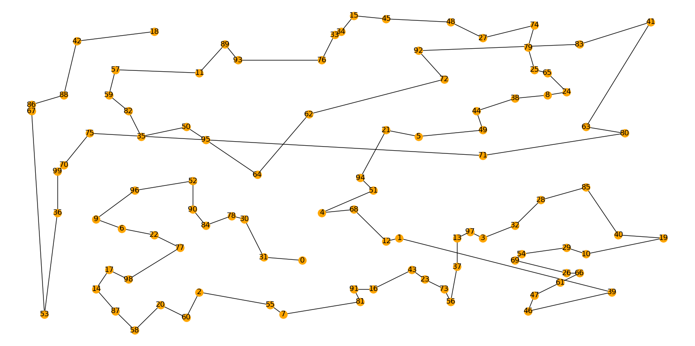
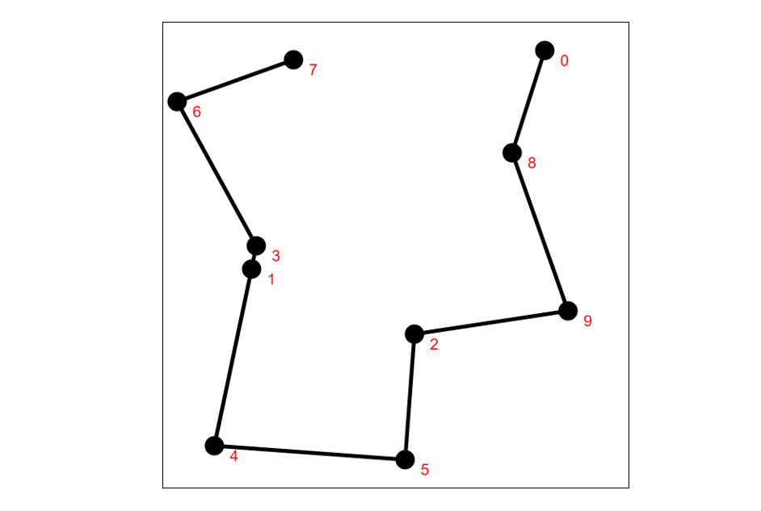

[](https://p5js.org)
[](https://www.python.org/)
[](https://github.com/armandwayoff/Travelling-Salesman-Problem/blob/master/LICENSE)

[](https://github.com/armandwayoff/Networks)

<p align="center">My Work on Networks</p>

## Table of Contents

* [Converting Non-Planar Graph to Planar](#converting-non-planar-graph-to-planar)
* [Nearest Neighbour Algorithm](#nearest-neighbour-algorithm)

## Converting Non-Planar Graph to Planar

* What's a [planar graph](https://en.wikipedia.org/wiki/Planar_graph) ?

This algorithm is a sub-algorithm that can be implemented in a more general algorithm for solving the travelling salesman problem.

The "Converting Non-Planar Graph to Planar" folder contains two versions, one in Python and one in JavaScript. Both versions generate a certain numbers of random vertices and then determine the path.

The Python version prints the coordinates of all the vertices, the path and the adjacency matrix. You can find an example below.

### Output Example

```
* Converting Non-Planar Graph to Planar *
Number of vertices : 10 | Dimensions of the canvas : (100 ; 100)

Vertices coordinates :
0 : (75 ; 10)
1 : (60 ; 89)
2 : (6 ; 11)
3 : (51 ; 46)
4 : (94 ; 44)
5 : (39 ; 0)
6 : (97 ; 84)
7 : (68 ; 73)
8 : (34 ; 94)
9 : (1 ; 66)
Path : [0, 4, 5, 2, 7, 3, 6, 1, 8, 9]
Adjacency matrix :
0 0 0 0 1 0 0 0 0 0
0 0 0 0 0 0 1 0 1 0
0 0 0 0 0 1 0 1 0 0
0 0 0 0 0 0 1 1 0 0
1 0 0 0 0 1 0 0 0 0
0 0 1 0 1 0 0 0 0 0
0 1 0 1 0 0 0 0 0 0
0 0 1 1 0 0 0 0 0 0
0 1 0 0 0 0 0 0 0 1
0 0 0 0 0 0 0 0 1 0
```

## Nearest Neighbour Algorithm

* What's the [nearest neighbour algorithm](https://en.wikipedia.org/wiki/Nearest_neighbour_algorithm) ?

The nearest neighbor algorithm quickly yields a short tour, but usually not the optimal one. Therefor, it is not at all an optimal solution to the travelling salesman problem but can be used as an initialisation path.

The "Nearest Neighbor Algorithm" folder contains two versions, one in Python and one in JavaScript.
Both versions generate a certain numbers of random vertices and then determine the path. 

The Python version prints the coordinates of all the vertices, the path and the adjacency matrix. You can find an example [below](#output-example).

The purpose of the JavaScript version is to visualise the algorithm. The Javascript version is programmed with the [p5.js library](https://p5js.org/). This library is ideal because it has a full set of drawing functionality.

### Output Example

```
* Nearest Neighbour Algorithm *
Number of vertices : 10 | Dimensions of the canvas : (100 ; 100)

Vertices coordinates :
0 : (82 ; 6)
1 : (19 ; 53)
2 : (54 ; 67)
3 : (20 ; 48)
4 : (11 ; 91)
5 : (52 ; 94)
6 : (3 ; 17)
7 : (28 ; 8)
8 : (75 ; 28)
9 : (87 ; 62)
Path : [0, 8, 9, 2, 5, 4, 1, 3, 6, 7]
Adjacency matrix :
0 0 0 0 0 0 0 0 1 0
0 0 0 1 1 0 0 0 0 0
0 0 0 0 0 1 0 0 0 1
0 1 0 0 0 0 1 0 0 0
0 1 0 0 0 1 0 0 0 0
0 0 1 0 1 0 0 0 0 0
0 0 0 1 0 0 0 1 0 0
0 0 0 0 0 0 1 0 0 0
1 0 0 0 0 0 0 0 0 1
0 0 1 0 0 0 0 0 1 0
```


### Visualisation of the Algorithm

This graph represents the example above.


